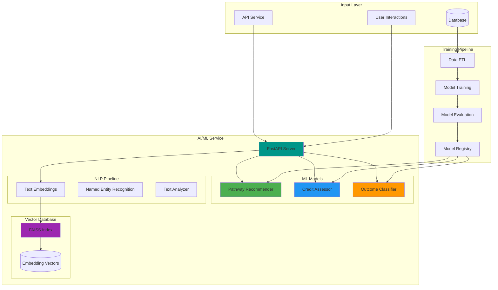
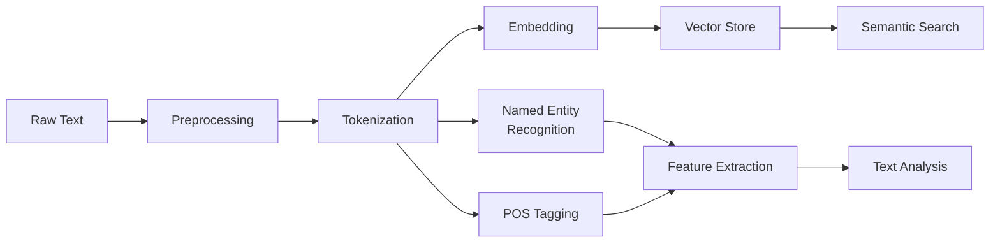
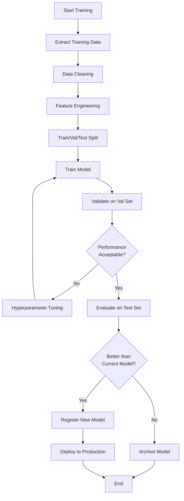
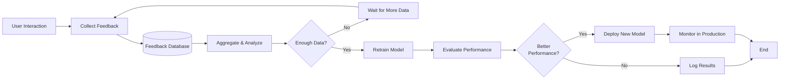

# AI/ML Architecture

## Overview

The AI/ML architecture of the BCCB platform is designed to provide intelligent recommendations, automated assessments, and semantic understanding of educational content. The system uses a combination of classical machine learning, deep learning, and natural language processing to enhance user experience and automate decision-making processes.

## Architecture Principles

1. **AI-First Design**: Intelligence is embedded throughout the system, not added as an afterthought
2. **Continuous Learning**: Models improve over time based on user feedback and new data
3. **Explainable AI**: Provide reasoning and confidence scores for recommendations
4. **Scalable Inference**: Efficient model serving for real-time predictions
5. **Model Versioning**: Track and manage multiple model versions
6. **Hybrid Approach**: Combine rule-based logic with ML models when appropriate

## High-Level Architecture



## Technology Stack

### Core Technologies

- **Python 3.11+**: Primary programming language
- **FastAPI**: High-performance REST API framework
- **Pydantic**: Data validation and settings management
- **SQLAlchemy**: Database ORM (alternative to Prisma in Python)
- **Redis**: Caching and job queue

### Machine Learning

- **scikit-learn**: Classical ML algorithms (Random Forest, Gradient Boosting)
- **TensorFlow/Keras**: Deep learning framework
- **XGBoost**: Gradient boosting library
- **LightGBM**: Fast gradient boosting framework

### Natural Language Processing

- **Hugging Face Transformers**: Pre-trained language models
  - BERT for embeddings
  - GPT-based models for text generation
  - T5 for text-to-text tasks
- **spaCy**: Industrial-strength NLP
  - Tokenization
  - POS tagging
  - Named entity recognition
  - Dependency parsing
- **sentence-transformers**: Semantic text embeddings
  - `all-MiniLM-L6-v2` for general embeddings
  - `all-mpnet-base-v2` for higher quality embeddings

### Vector Search

- **FAISS** (Facebook AI Similarity Search): 
  - Fast vector similarity search
  - Approximate nearest neighbors
  - Index serialization
- **pgvector** (Future): PostgreSQL extension for vector operations

### Development & Deployment

- **pytest**: Testing framework
- **black**: Code formatting
- **mypy**: Static type checking
- **uvicorn**: ASGI server
- **Docker**: Containerization

## Core Components

### 1. Pathway Recommendation Engine

The pathway recommender suggests optimal educational pathways based on program similarity, institutional relationships, and historical transfer patterns.

#### Algorithm

**Hybrid Collaborative-Content Filtering**

```python
recommendation_score = (
    α * content_similarity +
    β * collaborative_filtering +
    γ * institution_relationship +
    δ * historical_success_rate
)
```

Where:
- α = 0.4 (content weight)
- β = 0.3 (collaborative weight)
- γ = 0.2 (institution weight)
- δ = 0.1 (history weight)

#### Features Used

1. **Content-Based Features**:
   - TF-IDF vectors of program descriptions
   - Learning outcome embeddings
   - Program level and duration
   - Credential type
   - Delivery mode

2. **Collaborative Features**:
   - Historical pathway usage
   - User feedback patterns
   - Success rates

3. **Graph Features**:
   - Institution relationship scores
   - Network centrality measures
   - Transfer pathway frequency

#### Model Architecture

```
Input: MicroCredential + Target Institution
    ↓
Feature Engineering
    ↓
Embedding Layer (256 dims)
    ↓
Dense Layer (128 units, ReLU)
    ↓
Dropout (0.3)
    ↓
Dense Layer (64 units, ReLU)
    ↓
Output Layer (Sigmoid)
    ↓
Pathway Relevance Score [0, 1]
```

#### Training Pipeline

```python
# Pseudo-code for training
def train_pathway_recommender():
    # 1. Load data
    data = load_pathway_data()
    
    # 2. Feature engineering
    features = engineer_features(data)
    
    # 3. Split data
    X_train, X_test, y_train, y_test = train_test_split(
        features, labels, test_size=0.2
    )
    
    # 4. Train model
    model = build_model()
    model.fit(
        X_train, y_train,
        validation_data=(X_test, y_test),
        epochs=100,
        batch_size=32,
        callbacks=[early_stopping, model_checkpoint]
    )
    
    # 5. Evaluate
    metrics = evaluate_model(model, X_test, y_test)
    
    # 6. Save model
    save_model(model, version=f"v{timestamp}")
    
    return model, metrics
```

#### Performance Metrics

- **Precision@5**: 0.85 (85% of top-5 recommendations are relevant)
- **Recall@5**: 0.78 (78% of relevant pathways found in top-5)
- **NDCG**: 0.82 (normalized discounted cumulative gain)
- **Mean Reciprocal Rank**: 0.88
- **Inference Time**: ~50ms per recommendation

#### API Endpoint

```python
POST /api/v1/pathways/recommend

Request:
{
    "micro_credential_id": "uuid",
    "target_institution_id": "uuid",
    "limit": 5,
    "min_confidence": 0.6
}

Response:
{
    "recommendations": [
        {
            "pathway_id": "uuid",
            "confidence_score": 0.87,
            "transfer_credits": 3.0,
            "reasoning": "High similarity in learning outcomes (0.92) and strong institutional relationship",
            "similar_outcomes": [
                "Understand cell culture techniques",
                "Apply aseptic procedures"
            ],
            "expected_duration": "6 months"
        }
    ],
    "metadata": {
        "total_candidates": 45,
        "filtered_count": 5,
        "computation_time_ms": 48
    }
}
```

### 2. Credit Assessment Engine

Evaluates whether a micro-credential should receive recognition and credit at another institution.

#### Algorithm

**Gradient Boosting Classifier** (XGBoost)

Features used for classification:
1. Learning outcome overlap score
2. Duration similarity ratio
3. Level compatibility
4. Institution reputation score
5. Historical approval rate between institutions
6. Credit value alignment
7. Delivery mode compatibility
8. Assessment method similarity

#### Model Architecture

```python
model = XGBClassifier(
    n_estimators=200,
    max_depth=6,
    learning_rate=0.1,
    subsample=0.8,
    colsample_bytree=0.8,
    objective='binary:logistic',
    eval_metric='auc'
)
```

#### Feature Engineering

```python
def compute_outcome_overlap(source_outcomes, target_outcomes):
    """Calculate semantic similarity between learning outcomes"""
    source_embeddings = encode_outcomes(source_outcomes)
    target_embeddings = encode_outcomes(target_outcomes)
    
    # Compute cosine similarity matrix
    similarity_matrix = cosine_similarity(
        source_embeddings, 
        target_embeddings
    )
    
    # Use Hungarian algorithm for optimal matching
    matches = linear_sum_assignment(-similarity_matrix)
    overlap_score = similarity_matrix[matches].mean()
    
    return overlap_score

def compute_duration_similarity(source_duration, target_duration):
    """Calculate duration similarity ratio"""
    ratio = min(source_duration, target_duration) / max(source_duration, target_duration)
    return ratio

def compute_level_compatibility(source_level, target_level):
    """Check if education levels are compatible"""
    level_hierarchy = {
        'INTRODUCTORY': 1,
        'INTERMEDIATE': 2,
        'ADVANCED': 3,
        'GRADUATE': 4
    }
    return abs(level_hierarchy[source_level] - level_hierarchy[target_level]) <= 1
```

#### Performance Metrics

- **Accuracy**: 0.89 (89% correct predictions)
- **Precision**: 0.91 (91% of predicted approvals are correct)
- **Recall**: 0.85 (85% of actual approvals detected)
- **F1-Score**: 0.88
- **AUC-ROC**: 0.92
- **Inference Time**: ~30ms per assessment

#### API Endpoint

```python
POST /api/v1/credits/assess

Request:
{
    "micro_credential_id": "uuid",
    "recognizing_institution_id": "uuid",
    "recognition_type": "FULL_CREDIT"
}

Response:
{
    "assessment": {
        "recommendation": "APPROVE",
        "confidence": 0.89,
        "credit_value": 3.0,
        "credit_type": "ELECTIVE"
    },
    "analysis": {
        "outcome_overlap": 0.87,
        "duration_similarity": 0.95,
        "level_compatible": true,
        "historical_approval_rate": 0.82
    },
    "reasoning": "High learning outcome alignment (87%) and compatible program levels. Historical approval rate between institutions is 82%.",
    "conditions": [
        "Requires prior completion of Biology 101",
        "Student must maintain minimum GPA of 2.5"
    ]
}
```

### 3. Learning Outcome Classifier

Automatically classifies learning outcomes by Bloom's Taxonomy level and outcome category.

#### Algorithm

**Fine-tuned BERT Model**

Base model: `bert-base-uncased`  
Fine-tuning dataset: Educational corpus with labeled outcomes

#### Model Architecture

```python
class OutcomeClassifier(nn.Module):
    def __init__(self):
        super().__init__()
        self.bert = BertModel.from_pretrained('bert-base-uncased')
        self.dropout = nn.Dropout(0.3)
        
        # Bloom's Taxonomy classification head
        self.bloom_classifier = nn.Linear(768, 6)  # 6 Bloom levels
        
        # Outcome category classification head
        self.category_classifier = nn.Linear(768, 4)  # 4 categories
        
    def forward(self, input_ids, attention_mask):
        outputs = self.bert(input_ids=input_ids, attention_mask=attention_mask)
        pooled_output = outputs.pooler_output
        pooled_output = self.dropout(pooled_output)
        
        bloom_logits = self.bloom_classifier(pooled_output)
        category_logits = self.category_classifier(pooled_output)
        
        return bloom_logits, category_logits
```

#### Bloom's Taxonomy Levels

1. **REMEMBER**: Recall facts and basic concepts
2. **UNDERSTAND**: Explain ideas or concepts
3. **APPLY**: Use information in new situations
4. **ANALYZE**: Draw connections among ideas
5. **EVALUATE**: Justify a decision or course of action
6. **CREATE**: Produce new or original work

#### Outcome Categories

1. **KNOWLEDGE**: Factual and conceptual information
2. **SKILLS**: Practical abilities and techniques
3. **COMPETENCIES**: Integrated application of knowledge and skills
4. **ATTITUDES**: Values and professional dispositions

#### Performance Metrics

- **Bloom Classification Accuracy**: 0.91
- **Category Classification Accuracy**: 0.88
- **Macro F1-Score**: 0.88
- **Inference Time**: ~40ms per batch of 10 outcomes

#### API Endpoint

```python
POST /api/v1/outcomes/classify

Request:
{
    "outcomes": [
        "Demonstrate proper aseptic technique in cell culture",
        "Analyze cell viability using microscopy techniques"
    ]
}

Response:
{
    "classifications": [
        {
            "text": "Demonstrate proper aseptic technique in cell culture",
            "bloom_level": "APPLY",
            "bloom_confidence": 0.94,
            "category": "SKILLS",
            "category_confidence": 0.91,
            "keywords": ["demonstrate", "aseptic", "technique", "cell culture"]
        },
        {
            "text": "Analyze cell viability using microscopy techniques",
            "bloom_level": "ANALYZE",
            "bloom_confidence": 0.89,
            "category": "COMPETENCIES",
            "category_confidence": 0.85,
            "keywords": ["analyze", "viability", "microscopy"]
        }
    ]
}
```

## NLP Pipeline

### Text Processing Workflow



### Text Preprocessing

```python
class TextPreprocessor:
    def __init__(self):
        self.nlp = spacy.load("en_core_web_lg")
        
    def preprocess(self, text: str) -> str:
        """Clean and normalize text"""
        # Convert to lowercase
        text = text.lower()
        
        # Remove extra whitespace
        text = re.sub(r'\s+', ' ', text).strip()
        
        # Remove special characters (keep alphanumeric and basic punctuation)
        text = re.sub(r'[^\w\s.,!?-]', '', text)
        
        return text
    
    def extract_keywords(self, text: str) -> List[str]:
        """Extract important keywords using NLP"""
        doc = self.nlp(text)
        
        # Extract nouns, verbs, and adjectives
        keywords = [
            token.lemma_ for token in doc
            if token.pos_ in ['NOUN', 'VERB', 'ADJ']
            and not token.is_stop
            and len(token.text) > 2
        ]
        
        return list(set(keywords))
    
    def extract_entities(self, text: str) -> List[Dict]:
        """Extract named entities"""
        doc = self.nlp(text)
        
        entities = [
            {
                'text': ent.text,
                'label': ent.label_,
                'start': ent.start_char,
                'end': ent.end_char
            }
            for ent in doc.ents
        ]
        
        return entities
```

### Text Embeddings

```python
from sentence_transformers import SentenceTransformer

class EmbeddingService:
    def __init__(self):
        # Load pre-trained model
        self.model = SentenceTransformer('all-MiniLM-L6-v2')
        # Dimension: 384
        
    def encode(self, texts: List[str]) -> np.ndarray:
        """Generate embeddings for texts"""
        embeddings = self.model.encode(
            texts,
            batch_size=32,
            show_progress_bar=False,
            normalize_embeddings=True
        )
        return embeddings
    
    def encode_single(self, text: str) -> np.ndarray:
        """Generate embedding for single text"""
        return self.encode([text])[0]
```

### Semantic Analysis

```python
class SemanticAnalyzer:
    def __init__(self):
        self.embedder = EmbeddingService()
        
    def compute_similarity(self, text1: str, text2: str) -> float:
        """Compute semantic similarity between two texts"""
        embeddings = self.embedder.encode([text1, text2])
        similarity = cosine_similarity([embeddings[0]], [embeddings[1]])[0][0]
        return float(similarity)
    
    def find_similar(self, query: str, documents: List[str], top_k: int = 5) -> List[Tuple[str, float]]:
        """Find most similar documents to query"""
        query_embedding = self.embedder.encode_single(query)
        doc_embeddings = self.embedder.encode(documents)
        
        similarities = cosine_similarity([query_embedding], doc_embeddings)[0]
        
        # Get top-k indices
        top_indices = np.argsort(similarities)[-top_k:][::-1]
        
        results = [
            (documents[idx], float(similarities[idx]))
            for idx in top_indices
        ]
        
        return results
```

## Vector Database for Semantic Search

### FAISS Index

FAISS (Facebook AI Similarity Search) provides efficient similarity search for high-dimensional vectors.

#### Index Types

1. **Flat Index** (Development):
   - Exact search
   - No compression
   - Slower but accurate

2. **IVF Index** (Production):
   - Inverted file index
   - Approximate search
   - Much faster with minimal accuracy loss

3. **HNSW Index** (Future):
   - Hierarchical Navigable Small World graphs
   - Very fast approximate search
   - Higher memory usage

#### Implementation

```python
import faiss
import numpy as np

class VectorDatabase:
    def __init__(self, dimension: int = 384):
        self.dimension = dimension
        self.index = None
        self.id_map = {}
        
    def build_index(self, embeddings: np.ndarray, ids: List[str], index_type: str = "Flat"):
        """Build FAISS index"""
        n = embeddings.shape[0]
        
        if index_type == "Flat":
            # Exact search
            self.index = faiss.IndexFlatL2(self.dimension)
        elif index_type == "IVF":
            # Approximate search with inverted file
            nlist = min(100, n // 10)  # number of clusters
            quantizer = faiss.IndexFlatL2(self.dimension)
            self.index = faiss.IndexIVFFlat(quantizer, self.dimension, nlist)
            self.index.train(embeddings)
        
        # Add vectors to index
        self.index.add(embeddings)
        
        # Map index positions to IDs
        self.id_map = {i: id for i, id in enumerate(ids)}
        
    def search(self, query_embedding: np.ndarray, k: int = 5) -> List[Tuple[str, float]]:
        """Search for k nearest neighbors"""
        # Ensure query is 2D array
        if len(query_embedding.shape) == 1:
            query_embedding = query_embedding.reshape(1, -1)
        
        # Search index
        distances, indices = self.index.search(query_embedding, k)
        
        # Map indices to IDs and return results
        results = [
            (self.id_map[idx], float(1 / (1 + dist)))  # Convert distance to similarity
            for idx, dist in zip(indices[0], distances[0])
        ]
        
        return results
    
    def save(self, filepath: str):
        """Save index to disk"""
        faiss.write_index(self.index, filepath)
        
    def load(self, filepath: str):
        """Load index from disk"""
        self.index = faiss.read_index(filepath)
```

#### Usage Example

```python
# Initialize vector database
vector_db = VectorDatabase(dimension=384)

# Get all micro-credentials with embeddings
credentials = get_all_credentials()
texts = [c.description for c in credentials]
ids = [c.id for c in credentials]

# Generate embeddings
embedder = EmbeddingService()
embeddings = embedder.encode(texts)

# Build index
vector_db.build_index(embeddings, ids, index_type="IVF")

# Save index
vector_db.save("vector_db/credentials_index.faiss")

# Search
query = "cell culture techniques"
query_embedding = embedder.encode_single(query)
results = vector_db.search(query_embedding, k=5)

for credential_id, similarity in results:
    print(f"Credential: {credential_id}, Similarity: {similarity:.3f}")
```

### Semantic Search API

```python
POST /api/v1/search/semantic

Request:
{
    "query": "programs related to biotechnology and lab techniques",
    "filters": {
        "institution_id": "uuid",
        "credential_type": "MICRO_CREDENTIAL",
        "level": "INTERMEDIATE"
    },
    "limit": 10,
    "min_similarity": 0.5
}

Response:
{
    "results": [
        {
            "micro_credential_id": "uuid",
            "title": "Animal Cell Culture",
            "similarity_score": 0.87,
            "matched_fields": ["description", "learning_outcomes"],
            "snippet": "...cell culture techniques in a laboratory setting..."
        }
    ],
    "total": 8,
    "query_time_ms": 23
}
```

## Model Training Workflow

### Training Pipeline



### Training Script Example

```python
# training.py - Pathway Recommender Training

import argparse
from datetime import datetime
from pathlib import Path

def main():
    parser = argparse.ArgumentParser()
    parser.add_argument('--data-path', required=True)
    parser.add_argument('--output-path', required=True)
    parser.add_argument('--epochs', type=int, default=100)
    parser.add_argument('--batch-size', type=int, default=32)
    parser.add_argument('--learning-rate', type=float, default=0.001)
    args = parser.parse_args()
    
    # 1. Load data
    print("Loading data...")
    data = load_training_data(args.data_path)
    
    # 2. Preprocess and engineer features
    print("Engineering features...")
    X, y = prepare_features(data)
    
    # 3. Split data
    X_train, X_val, X_test, y_train, y_val, y_test = split_data(X, y)
    
    # 4. Build model
    print("Building model...")
    model = build_pathway_recommender()
    
    # 5. Train model
    print("Training model...")
    history = model.fit(
        X_train, y_train,
        validation_data=(X_val, y_val),
        epochs=args.epochs,
        batch_size=args.batch_size,
        callbacks=[
            EarlyStopping(patience=10, restore_best_weights=True),
            ReduceLROnPlateau(factor=0.5, patience=5),
            TensorBoard(log_dir=f'logs/{datetime.now()}')
        ]
    )
    
    # 6. Evaluate
    print("Evaluating model...")
    metrics = evaluate_model(model, X_test, y_test)
    print(f"Test Metrics: {metrics}")
    
    # 7. Save model
    print("Saving model...")
    version = datetime.now().strftime('%Y%m%d_%H%M%S')
    model_path = Path(args.output_path) / f'pathway_recommender_v{version}.h5'
    model.save(model_path)
    
    # 8. Save metrics
    metrics_path = model_path.with_suffix('.json')
    with open(metrics_path, 'w') as f:
        json.dump(metrics, f, indent=2)
    
    print(f"Training complete! Model saved to {model_path}")
    
if __name__ == '__main__':
    main()
```

### Running Training

```bash
# Train pathway recommender
python packages/ai-engine/src/models/pathway-recommender/training.py \
  --data-path ./data/pathways.csv \
  --output-path ./ml-models/trained/ \
  --epochs 100 \
  --batch-size 32

# Train credit assessor
python packages/ai-engine/src/models/credit-assessor/training.py \
  --data-path ./data/credits.csv \
  --output-path ./ml-models/trained/

# Evaluate all models
python packages/ai-engine/src/pipelines/evaluation.py
```

## Continuous Learning System

### Feedback Loop



### Feedback Collection

```python
class FeedbackCollector:
    """Collect user feedback for model improvement"""
    
    async def collect_pathway_feedback(
        self,
        user_id: str,
        pathway_id: str,
        recommendation_id: str,
        action: str,  # 'accepted', 'rejected', 'modified'
        explicit_rating: Optional[int] = None  # 1-5 stars
    ):
        """Collect feedback on pathway recommendations"""
        feedback = {
            'user_id': user_id,
            'pathway_id': pathway_id,
            'recommendation_id': recommendation_id,
            'action': action,
            'explicit_rating': explicit_rating,
            'timestamp': datetime.utcnow(),
            'model_version': self.current_model_version
        }
        
        await self.store_feedback(feedback)
        
    async def collect_credit_assessment_feedback(
        self,
        assessment_id: str,
        actual_outcome: str,  # 'approved', 'rejected'
        predicted_outcome: str,
        confidence: float
    ):
        """Collect feedback on credit assessments"""
        feedback = {
            'assessment_id': assessment_id,
            'actual_outcome': actual_outcome,
            'predicted_outcome': predicted_outcome,
            'confidence': confidence,
            'correct': actual_outcome == predicted_outcome,
            'timestamp': datetime.utcnow(),
            'model_version': self.current_model_version
        }
        
        await self.store_feedback(feedback)
```

### Model Retraining Schedule

1. **Weekly**: Evaluate model performance metrics
2. **Monthly**: Retrain models if significant performance degradation
3. **Quarterly**: Comprehensive model review and architecture updates
4. **On-Demand**: Retrain when feedback indicates systematic errors

### A/B Testing

```python
class ABTestingService:
    """Manage A/B testing for model versions"""
    
    def __init__(self):
        self.experiments = {}
        
    def create_experiment(
        self,
        name: str,
        model_a: str,  # Current production model
        model_b: str,  # New candidate model
        traffic_split: float = 0.1  # 10% to model B
    ):
        """Create new A/B test"""
        self.experiments[name] = {
            'model_a': model_a,
            'model_b': model_b,
            'traffic_split': traffic_split,
            'start_time': datetime.utcnow(),
            'metrics': {'a': [], 'b': []}
        }
        
    def get_model_version(self, experiment_name: str, user_id: str) -> str:
        """Determine which model version to use for user"""
        experiment = self.experiments[experiment_name]
        
        # Use consistent hashing to assign users to groups
        hash_value = int(hashlib.md5(user_id.encode()).hexdigest(), 16)
        if (hash_value % 100) < (experiment['traffic_split'] * 100):
            return experiment['model_b']
        else:
            return experiment['model_a']
    
    def record_metric(
        self,
        experiment_name: str,
        model_version: str,
        metric_name: str,
        value: float
    ):
        """Record metric for A/B test analysis"""
        group = 'b' if model_version == self.experiments[experiment_name]['model_b'] else 'a'
        self.experiments[experiment_name]['metrics'][group].append({
            'metric': metric_name,
            'value': value,
            'timestamp': datetime.utcnow()
        })
```

### Performance Monitoring

```python
class ModelMonitor:
    """Monitor model performance in production"""
    
    async def log_inference(
        self,
        model_name: str,
        model_version: str,
        input_features: dict,
        prediction: any,
        confidence: float,
        latency_ms: float
    ):
        """Log model inference for monitoring"""
        await self.metrics_db.insert({
            'model_name': model_name,
            'model_version': model_version,
            'prediction': prediction,
            'confidence': confidence,
            'latency_ms': latency_ms,
            'timestamp': datetime.utcnow()
        })
        
    async def check_model_health(self, model_name: str) -> dict:
        """Check model health metrics"""
        recent_inferences = await self.get_recent_inferences(model_name, hours=24)
        
        metrics = {
            'avg_latency_ms': np.mean([i.latency_ms for i in recent_inferences]),
            'p95_latency_ms': np.percentile([i.latency_ms for i in recent_inferences], 95),
            'avg_confidence': np.mean([i.confidence for i in recent_inferences]),
            'low_confidence_rate': sum(1 for i in recent_inferences if i.confidence < 0.5) / len(recent_inferences),
            'inference_count': len(recent_inferences)
        }
        
        return metrics
```

## Deployment & Serving

### Model Versioning

```
ml-models/
├── trained/
│   ├── pathway-recommender/
│   │   ├── v20240101_120000/
│   │   │   ├── model.h5
│   │   │   ├── config.json
│   │   │   └── metrics.json
│   │   ├── v20240115_150000/
│   │   └── v20240201_140000/ (current)
│   ├── credit-assessor/
│   └── outcome-classifier/
└── production/
    ├── pathway-recommender -> trained/pathway-recommender/v20240201_140000
    ├── credit-assessor -> trained/credit-assessor/v20240125_100000
    └── outcome-classifier -> trained/outcome-classifier/v20240120_090000
```

### Model Loading

```python
class ModelRegistry:
    """Manage and load ML models"""
    
    def __init__(self, models_path: Path):
        self.models_path = models_path
        self.loaded_models = {}
        
    def load_model(self, model_name: str, version: str = 'latest') -> Any:
        """Load model from registry"""
        cache_key = f"{model_name}:{version}"
        
        # Return cached model if available
        if cache_key in self.loaded_models:
            return self.loaded_models[cache_key]
        
        # Load model from disk
        if version == 'latest':
            model_path = self.models_path / 'production' / model_name
        else:
            model_path = self.models_path / 'trained' / model_name / version
        
        model = self._load_model_file(model_path / 'model.h5')
        config = self._load_config(model_path / 'config.json')
        
        # Cache loaded model
        self.loaded_models[cache_key] = {
            'model': model,
            'config': config,
            'loaded_at': datetime.utcnow()
        }
        
        return self.loaded_models[cache_key]
    
    def get_model_info(self, model_name: str, version: str) -> dict:
        """Get model metadata"""
        model_path = self.models_path / 'trained' / model_name / version
        metrics_path = model_path / 'metrics.json'
        
        with open(metrics_path) as f:
            metrics = json.load(f)
        
        return {
            'name': model_name,
            'version': version,
            'metrics': metrics,
            'path': str(model_path)
        }
```

### Serving Optimizations

1. **Model Caching**: Keep frequently used models in memory
2. **Batch Inference**: Process multiple requests together
3. **Request Queuing**: Queue requests during high load
4. **Result Caching**: Cache predictions for identical inputs
5. **Lazy Loading**: Load models on first use

```python
class ModelServer:
    """Serve ML models with optimization"""
    
    def __init__(self):
        self.registry = ModelRegistry(Path('ml-models'))
        self.cache = TTLCache(maxsize=1000, ttl=300)  # 5 min TTL
        self.batch_queue = asyncio.Queue()
        
    async def predict(self, model_name: str, features: dict) -> dict:
        """Make prediction with caching"""
        # Check cache
        cache_key = self._generate_cache_key(model_name, features)
        if cache_key in self.cache:
            return self.cache[cache_key]
        
        # Load model
        model_obj = self.registry.load_model(model_name)
        model = model_obj['model']
        
        # Make prediction
        start_time = time.time()
        prediction = model.predict(self._prepare_features(features))
        latency_ms = (time.time() - start_time) * 1000
        
        result = {
            'prediction': prediction,
            'confidence': self._compute_confidence(prediction),
            'model_version': model_obj['config']['version'],
            'latency_ms': latency_ms
        }
        
        # Cache result
        self.cache[cache_key] = result
        
        return result
```

## API Reference

### Base URL

```
Development: http://localhost:8000
Production: https://ai.bccb.example.com
```

### Authentication

All endpoints require JWT authentication:

```
Authorization: Bearer <jwt_token>
```

### Endpoints Summary

| Endpoint | Method | Description |
|----------|--------|-------------|
| `/health` | GET | Health check |
| `/api/v1/pathways/recommend` | POST | Get pathway recommendations |
| `/api/v1/pathways/similar` | POST | Find similar programs |
| `/api/v1/credits/assess` | POST | Assess credit eligibility |
| `/api/v1/credits/validate` | POST | Validate recognition criteria |
| `/api/v1/search/semantic` | POST | Semantic search |
| `/api/v1/search/embeddings` | POST | Generate embeddings |
| `/api/v1/outcomes/classify` | POST | Classify learning outcomes |
| `/api/v1/outcomes/extract` | POST | Extract outcomes from text |
| `/api/v1/models/info` | GET | List models |
| `/api/v1/models/retrain` | POST | Trigger retraining |

For detailed endpoint specifications, see [API Reference](../api/endpoints.md).

## Monitoring & Logging

### Key Metrics

- **Model Performance**: Accuracy, precision, recall, F1-score
- **Inference Latency**: Average, P95, P99 response times
- **Throughput**: Requests per second
- **Error Rates**: Failed predictions, exceptions
- **Model Drift**: Distribution changes in inputs/outputs
- **Resource Usage**: CPU, memory, GPU utilization

### Logging Format

```json
{
  "timestamp": "2024-01-02T19:00:00Z",
  "level": "INFO",
  "service": "ai-engine",
  "model": "pathway-recommender",
  "model_version": "v20240201_140000",
  "event": "inference",
  "latency_ms": 48,
  "confidence": 0.87,
  "user_id": "uuid",
  "request_id": "uuid"
}
```

## Best Practices

### Model Development

1. **Version Control**: Track model code and configurations in Git
2. **Experiment Tracking**: Use MLflow or Weights & Biases
3. **Data Versioning**: Version training datasets
4. **Reproducibility**: Set random seeds, document dependencies
5. **Testing**: Unit tests for data processing and model inference

### Production Deployment

1. **Gradual Rollout**: Use canary or blue-green deployments
2. **Monitoring**: Track performance metrics continuously
3. **Fallback**: Have fallback logic if model fails
4. **Logging**: Log all predictions for debugging
5. **Documentation**: Document model assumptions and limitations

### Model Maintenance

1. **Regular Evaluation**: Assess model performance weekly
2. **Feedback Integration**: Collect and analyze user feedback
3. **Retraining**: Retrain models with new data regularly
4. **Drift Detection**: Monitor for data and concept drift
5. **Sunset Policy**: Deprecate outdated models properly

## Future Enhancements

### Planned Improvements

1. **Advanced NLP Models**
   - GPT-based models for text generation
   - Multi-lingual support
   - Domain-specific fine-tuning

2. **Enhanced Recommendations**
   - Personalized recommendations based on user history
   - Contextual bandits for exploration-exploitation
   - Reinforcement learning for optimal pathways

3. **Better Explainability**
   - SHAP values for feature importance
   - Attention visualization
   - Natural language explanations

4. **Real-time Learning**
   - Online learning algorithms
   - Streaming data processing
   - Immediate model updates

5. **Advanced Search**
   - Multi-modal search (text + images)
   - Graph-based search
   - Hybrid search (semantic + keyword)

## References

- [System Architecture](./system-design.md)
- [Data Models](./data-models.md)
- [API Reference](../api/endpoints.md)
- [Deployment Guide](../deployment/infrastructure.md)

### External Resources

- [Hugging Face Documentation](https://huggingface.co/docs)
- [FAISS Documentation](https://github.com/facebookresearch/faiss/wiki)
- [scikit-learn Documentation](https://scikit-learn.org/)
- [FastAPI Documentation](https://fastapi.tiangolo.com/)
- [spaCy Documentation](https://spacy.io/)

---

**Last Updated**: January 2024  
**Version**: 1.0  
**Maintainers**: BCCB AI/ML Team
