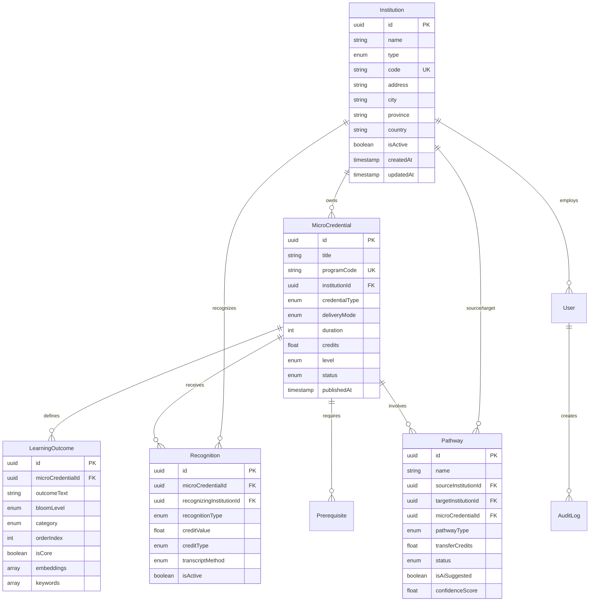

# Data Models

## Overview

This document provides comprehensive documentation of all data models in the BCCB platform. The system uses Prisma ORM with PostgreSQL for type-safe database access and automatic migrations.

## Database Technology

- **Database**: PostgreSQL 15+
- **ORM**: Prisma
- **Schema Location**: `database/schema/schema.prisma`
- **Migration Tool**: Prisma Migrate

## Entity Relationship Diagram



## Core Models

### Institution

Represents educational institutions (universities, colleges, institutes) participating in the micro-credentials system.

**Table Name**: `institutions`

**Fields:**

| Field | Type | Constraints | Description |
|-------|------|-------------|-------------|
| `id` | String (UUID) | Primary Key | Unique identifier |
| `name` | String | Required | Full institution name |
| `type` | InstitutionType | Required | Type of institution |
| `code` | String | Required, Unique | Short institution code (e.g., "BCIT") |
| `address` | String | Optional | Street address |
| `city` | String | Optional | City name |
| `province` | String | Optional | Province/state |
| `postalCode` | String | Optional | Postal/ZIP code |
| `country` | String | Default: "Canada" | Country name |
| `website` | String | Optional | Institution website URL |
| `contactEmail` | String | Optional | Primary contact email |
| `contactPhone` | String | Optional | Primary contact phone |
| `isActive` | Boolean | Default: true | Active status |
| `createdAt` | DateTime | Auto | Creation timestamp |
| `updatedAt` | DateTime | Auto | Last update timestamp |

**Relationships:**
- Has many `MicroCredential` (as owner)
- Has many `Recognition` (as recognizing institution)
- Has many `Pathway` (as source or target)
- Has many `User` (as employer)

**Indexes:**
- Primary: `id`
- Unique: `code`
- Index: `type`

**Design Decisions:**
- UUID primary keys for distributed system compatibility
- Soft delete using `isActive` flag to maintain referential integrity
- `code` field for human-readable institution identification
- Separate contact fields for flexibility in communication

**Example:**
```typescript
{
  id: "550e8400-e29b-41d4-a716-446655440000",
  name: "British Columbia Institute of Technology",
  type: "INSTITUTE",
  code: "BCIT",
  address: "3700 Willingdon Ave",
  city: "Burnaby",
  province: "BC",
  postalCode: "V5G 3H2",
  country: "Canada",
  website: "https://www.bcit.ca",
  contactEmail: "info@bcit.ca",
  contactPhone: "+1-604-434-5734",
  isActive: true,
  createdAt: "2024-01-01T00:00:00.000Z",
  updatedAt: "2024-01-02T10:00:00.000Z"
}
```

---

### MicroCredential

Represents a micro-credential program offered by an institution.

**Table Name**: `micro_credentials`

**Fields:**

| Field | Type | Constraints | Description |
|-------|------|-------------|-------------|
| `id` | String (UUID) | Primary Key | Unique identifier |
| `title` | String | Required | Full program title |
| `shortTitle` | String | Optional | Abbreviated title |
| `description` | String | Required | Detailed program description |
| `programCode` | String | Required, Unique | Unique program code |
| `institutionId` | String (UUID) | Required, FK | Owning institution |
| `credentialType` | CredentialType | Required | Type of credential |
| `deliveryMode` | DeliveryMode | Required | How program is delivered |
| `duration` | Int | Required | Duration in hours |
| `credits` | Float | Optional | Academic credits |
| `assessmentMethod` | String | Optional | Assessment methodology |
| `cost` | Float | Optional | Program cost |
| `language` | String | Default: "English" | Primary language |
| `level` | EducationLevel | Required | Education level |
| `campus` | String | Optional | Campus location |
| `department` | String | Optional | Academic department |
| `faculty` | String | Optional | Faculty/school |
| `status` | CredentialStatus | Default: DRAFT | Publication status |
| `isActive` | Boolean | Default: true | Active status |
| `effectiveDate` | DateTime | Optional | When program becomes effective |
| `expiryDate` | DateTime | Optional | When program expires |
| `lastReviewDate` | DateTime | Optional | Last review date |
| `nextReviewDate` | DateTime | Optional | Next scheduled review |
| `programUrl` | String | Optional | Program webpage URL |
| `applicationUrl` | String | Optional | Application URL |
| `additionalInfo` | String | Optional | Additional information |
| `createdAt` | DateTime | Auto | Creation timestamp |
| `updatedAt` | DateTime | Auto | Last update timestamp |
| `publishedAt` | DateTime | Optional | Publication timestamp |

**Relationships:**
- Belongs to one `Institution`
- Has many `LearningOutcome`
- Has many `Recognition`
- Has many `Pathway`
- Has many `Prerequisite`

**Indexes:**
- Primary: `id`
- Unique: `programCode`
- Index: `institutionId`, `status`, `credentialType`

**Design Decisions:**
- `programCode` must be unique across all institutions to prevent confusion
- `status` workflow: DRAFT → UNDER_REVIEW → PUBLISHED → ARCHIVED
- Duration stored in hours for precision and consistency
- Separate URL fields for program info vs. application
- Optional expiry date for time-limited programs
- Review date tracking for quality assurance

**Example:**
```typescript
{
  id: "660e8400-e29b-41d4-a716-446655440000",
  title: "Animal Cell Culture",
  shortTitle: "ACC",
  description: "This micro-credential provides foundational knowledge and practical skills in animal cell culture techniques...",
  programCode: "26.0406",
  institutionId: "550e8400-e29b-41d4-a716-446655440000",
  credentialType: "MICRO_CREDENTIAL",
  deliveryMode: "HYBRID",
  duration: 120,
  credits: 3.0,
  assessmentMethod: "Practical demonstration and written exam",
  cost: 1500.00,
  language: "English",
  level: "INTERMEDIATE",
  campus: "Burnaby",
  department: "Life Sciences",
  faculty: "School of Health Sciences",
  status: "PUBLISHED",
  isActive: true,
  effectiveDate: "2024-01-01T00:00:00.000Z",
  programUrl: "https://www.bcit.ca/programs/animal-cell-culture",
  createdAt: "2023-12-15T00:00:00.000Z",
  updatedAt: "2024-01-02T10:00:00.000Z",
  publishedAt: "2024-01-01T00:00:00.000Z"
}
```

---

### LearningOutcome

Represents a specific learning outcome for a micro-credential.

**Table Name**: `learning_outcomes`

**Fields:**

| Field | Type | Constraints | Description |
|-------|------|-------------|-------------|
| `id` | String (UUID) | Primary Key | Unique identifier |
| `microCredentialId` | String (UUID) | Required, FK | Associated credential |
| `outcomeText` | String | Required | Learning outcome description |
| `bloomLevel` | BloomLevel | Required | Bloom's Taxonomy level |
| `category` | OutcomeCategory | Required | Outcome category |
| `orderIndex` | Int | Required | Display order |
| `isCore` | Boolean | Default: true | Core vs. optional outcome |
| `embeddings` | Float[] | Optional | AI-generated vector embeddings |
| `keywords` | String[] | Optional | Extracted keywords |
| `createdAt` | DateTime | Auto | Creation timestamp |
| `updatedAt` | DateTime | Auto | Last update timestamp |

**Relationships:**
- Belongs to one `MicroCredential`

**Indexes:**
- Primary: `id`
- Index: `microCredentialId`

**Design Decisions:**
- `embeddings` field stores 384-dimensional vectors for semantic search (future: migrate to pgvector)
- `bloomLevel` categorizes cognitive complexity
- `category` distinguishes knowledge, skills, competencies, attitudes
- `orderIndex` maintains consistent presentation order
- `isCore` allows differentiation between required and optional outcomes
- Keywords extracted via NLP for better search

**Example:**
```typescript
{
  id: "770e8400-e29b-41d4-a716-446655440000",
  microCredentialId: "660e8400-e29b-41d4-a716-446655440000",
  outcomeText: "Demonstrate proper aseptic technique in cell culture procedures",
  bloomLevel: "APPLY",
  category: "SKILLS",
  orderIndex: 1,
  isCore: true,
  embeddings: [0.123, -0.456, 0.789, ...], // 384 dimensions
  keywords: ["demonstrate", "aseptic", "technique", "cell", "culture"],
  createdAt: "2024-01-01T00:00:00.000Z",
  updatedAt: "2024-01-01T00:00:00.000Z"
}
```

---

### Recognition

Represents recognition of a micro-credential by another institution.

**Table Name**: `recognitions`

**Fields:**

| Field | Type | Constraints | Description |
|-------|------|-------------|-------------|
| `id` | String (UUID) | Primary Key | Unique identifier |
| `microCredentialId` | String (UUID) | Required, FK | Recognized credential |
| `recognizingInstitutionId` | String (UUID) | Required, FK | Institution providing recognition |
| `recognitionType` | RecognitionType | Required | Type of recognition |
| `creditValue` | Float | Optional | Number of credits granted |
| `creditType` | CreditType | Optional | Type of credits |
| `transcriptMethod` | TranscriptMethod | Required | How recognition is recorded |
| `conditions` | String | Optional | Conditions for recognition |
| `effectiveDate` | DateTime | Required | When recognition begins |
| `expiryDate` | DateTime | Optional | When recognition expires |
| `isActive` | Boolean | Default: true | Active status |
| `approvalReference` | String | Optional | Reference number for approval |
| `notes` | String | Optional | Additional notes |
| `badgeUrl` | String | Optional | Digital badge URL |
| `certificateTemplateId` | String | Optional | Certificate template ID |
| `createdAt` | DateTime | Auto | Creation timestamp |
| `updatedAt` | DateTime | Auto | Last update timestamp |

**Relationships:**
- Belongs to one `MicroCredential`
- Belongs to one `Institution` (recognizing)

**Indexes:**
- Primary: `id`
- Index: `microCredentialId`, `recognizingInstitutionId`, `recognitionType`

**Design Decisions:**
- Separate `effectiveDate` and `expiryDate` for time-bounded recognition
- `transcriptMethod` indicates how students see recognition on records
- `conditions` field allows flexibility for institution-specific requirements
- Optional digital badge integration
- `approvalReference` for institutional audit trails

**Example:**
```typescript
{
  id: "880e8400-e29b-41d4-a716-446655440000",
  microCredentialId: "660e8400-e29b-41d4-a716-446655440000",
  recognizingInstitutionId: "990e8400-e29b-41d4-a716-446655440000",
  recognitionType: "FULL_CREDIT",
  creditValue: 3.0,
  creditType: "ELECTIVE",
  transcriptMethod: "LISTED_ON_TRANSCRIPT",
  conditions: "Minimum grade of B required",
  effectiveDate: "2024-01-01T00:00:00.000Z",
  expiryDate: "2029-12-31T23:59:59.000Z",
  isActive: true,
  approvalReference: "REF-2024-001",
  notes: "Approved by curriculum committee on Dec 15, 2023",
  createdAt: "2024-01-01T00:00:00.000Z",
  updatedAt: "2024-01-01T00:00:00.000Z"
}
```

---

### Pathway

Represents an educational pathway between institutions.

**Table Name**: `pathways`

**Fields:**

| Field | Type | Constraints | Description |
|-------|------|-------------|-------------|
| `id` | String (UUID) | Primary Key | Unique identifier |
| `name` | String | Required | Pathway name |
| `description` | String | Optional | Detailed description |
| `sourceInstitutionId` | String (UUID) | Required, FK | Starting institution |
| `targetInstitutionId` | String (UUID) | Required, FK | Destination institution |
| `microCredentialId` | String (UUID) | Required, FK | Source credential |
| `pathwayType` | PathwayType | Required | Type of pathway |
| `transferCredits` | Float | Optional | Credits transferred |
| `equivalencyNotes` | String | Optional | Equivalency details |
| `additionalRequirements` | String | Optional | Additional requirements |
| `confidenceScore` | Float | Optional | AI confidence (0-1) |
| `isAiSuggested` | Boolean | Default: false | AI-generated suggestion |
| `aiReasoning` | String | Optional | AI reasoning explanation |
| `status` | PathwayStatus | Default: DRAFT | Approval status |
| `isActive` | Boolean | Default: true | Active status |
| `approvedBy` | String | Optional | Approver name |
| `approvedAt` | DateTime | Optional | Approval timestamp |
| `createdAt` | DateTime | Auto | Creation timestamp |
| `updatedAt` | DateTime | Auto | Last update timestamp |

**Relationships:**
- Belongs to one `Institution` (source)
- Belongs to one `Institution` (target)
- Belongs to one `MicroCredential`

**Indexes:**
- Primary: `id`
- Index: `sourceInstitutionId`, `targetInstitutionId`, `microCredentialId`, `pathwayType`

**Design Decisions:**
- Allows same institution as source and target for internal pathways
- `confidenceScore` and `aiReasoning` track AI recommendation quality
- `isAiSuggested` flag distinguishes manual vs. AI-created pathways
- Status workflow: DRAFT → UNDER_REVIEW → APPROVED → ACTIVE
- Can be suspended without deletion for temporary changes

**Example:**
```typescript
{
  id: "aa0e8400-e29b-41d4-a716-446655440000",
  name: "BCIT ACC to UBC Biology",
  description: "Pathway from Animal Cell Culture micro-credential to UBC Biology program",
  sourceInstitutionId: "550e8400-e29b-41d4-a716-446655440000",
  targetInstitutionId: "990e8400-e29b-41d4-a716-446655440000",
  microCredentialId: "660e8400-e29b-41d4-a716-446655440000",
  pathwayType: "EXTERNAL",
  transferCredits: 3.0,
  equivalencyNotes: "Counts towards Biology elective requirements",
  additionalRequirements: "Minimum GPA of 3.0 required",
  confidenceScore: 0.87,
  isAiSuggested: true,
  aiReasoning: "High learning outcome similarity (0.92) and strong institutional relationship",
  status: "ACTIVE",
  isActive: true,
  approvedBy: "Dr. Jane Smith",
  approvedAt: "2024-01-05T00:00:00.000Z",
  createdAt: "2024-01-01T00:00:00.000Z",
  updatedAt: "2024-01-05T10:00:00.000Z"
}
```

---

### Prerequisite

Represents prerequisites for a micro-credential.

**Table Name**: `prerequisites`

**Fields:**

| Field | Type | Constraints | Description |
|-------|------|-------------|-------------|
| `id` | String (UUID) | Primary Key | Unique identifier |
| `microCredentialId` | String (UUID) | Required, FK | Associated credential |
| `description` | String | Required | Prerequisite description |
| `type` | PrerequisiteType | Required | Type of prerequisite |
| `isMandatory` | Boolean | Default: true | Required vs. recommended |
| `orderIndex` | Int | Required | Display order |
| `createdAt` | DateTime | Auto | Creation timestamp |
| `updatedAt` | DateTime | Auto | Last update timestamp |

**Relationships:**
- Belongs to one `MicroCredential`

**Indexes:**
- Primary: `id`
- Index: `microCredentialId`

**Design Decisions:**
- Flexible `description` allows natural language prerequisites
- `type` categorizes prerequisites for filtering
- `isMandatory` distinguishes required vs. recommended
- `orderIndex` maintains logical presentation order

**Example:**
```typescript
{
  id: "bb0e8400-e29b-41d4-a716-446655440000",
  microCredentialId: "660e8400-e29b-41d4-a716-446655440000",
  description: "Basic biology knowledge or equivalent",
  type: "ACADEMIC",
  isMandatory: true,
  orderIndex: 1,
  createdAt: "2024-01-01T00:00:00.000Z",
  updatedAt: "2024-01-01T00:00:00.000Z"
}
```

---

## Supporting Models

### User

Represents system users.

**Table Name**: `users`

**Fields:**

| Field | Type | Constraints | Description |
|-------|------|-------------|-------------|
| `id` | String (UUID) | Primary Key | Unique identifier |
| `email` | String | Required, Unique | User email address |
| `passwordHash` | String | Required | Hashed password |
| `firstName` | String | Required | First name |
| `lastName` | String | Required | Last name |
| `role` | UserRole | Default: USER | User role |
| `institutionId` | String (UUID) | Optional, FK | Associated institution |
| `isActive` | Boolean | Default: true | Active status |
| `lastLoginAt` | DateTime | Optional | Last login timestamp |
| `createdAt` | DateTime | Auto | Creation timestamp |
| `updatedAt` | DateTime | Auto | Last update timestamp |

**Relationships:**
- Belongs to one `Institution` (optional)

**Indexes:**
- Primary: `id`
- Unique: `email`
- Index: `institutionId`

**Design Decisions:**
- Email used as username for authentication
- Password stored as bcrypt hash
- Role-based access control (RBAC)
- Optional institution association for external users
- `lastLoginAt` for activity tracking

---

### AuditLog

Tracks all significant changes to entities.

**Table Name**: `audit_logs`

**Fields:**

| Field | Type | Constraints | Description |
|-------|------|-------------|-------------|
| `id` | String (UUID) | Primary Key | Unique identifier |
| `entityType` | String | Required | Type of entity changed |
| `entityId` | String | Required | ID of entity changed |
| `action` | AuditAction | Required | Type of action |
| `userId` | String (UUID) | Optional, FK | User who performed action |
| `changes` | Json | Required | Before/after values |
| `ipAddress` | String | Optional | Request IP address |
| `userAgent` | String | Optional | Request user agent |
| `createdAt` | DateTime | Auto | Action timestamp |

**Relationships:**
- References `User` (optional, for system actions)

**Indexes:**
- Primary: `id`
- Composite: `(entityType, entityId)`
- Index: `userId`, `createdAt`

**Design Decisions:**
- Generic design supports auditing any entity type
- `changes` JSON field stores flexible before/after data
- IP and user agent for security tracking
- No updates or deletes - append-only for audit trail
- Indexed on `createdAt` for time-based queries

**Example:**
```typescript
{
  id: "cc0e8400-e29b-41d4-a716-446655440000",
  entityType: "MicroCredential",
  entityId: "660e8400-e29b-41d4-a716-446655440000",
  action: "UPDATE",
  userId: "dd0e8400-e29b-41d4-a716-446655440000",
  changes: {
    status: {
      before: "DRAFT",
      after: "PUBLISHED"
    },
    publishedAt: {
      before: null,
      after: "2024-01-01T00:00:00.000Z"
    }
  },
  ipAddress: "192.168.1.100",
  userAgent: "Mozilla/5.0 (Windows NT 10.0; Win64; x64)...",
  createdAt: "2024-01-01T00:00:00.000Z"
}
```

---

## Enums

### InstitutionType

Categories of educational institutions.

```typescript
enum InstitutionType {
  UNIVERSITY      // Research-intensive universities
  COLLEGE         // Community colleges
  INSTITUTE       // Specialized institutes (e.g., BCIT)
  POLYTECHNIC     // Polytechnic institutions
  EXTERNAL        // External/international institutions
}
```

---

### CredentialType

Types of credentials offered.

```typescript
enum CredentialType {
  MICRO_CREDENTIAL    // Short-form micro-credentials
  CERTIFICATE         // Certificate programs
  DIPLOMA             // Diploma programs
  BADGE               // Digital badges
  SPECIALIZATION      // Specialization programs
}
```

**Design Decision**: Focused on stackable credentials shorter than full degrees.

---

### DeliveryMode

How programs are delivered to students.

```typescript
enum DeliveryMode {
  IN_PERSON      // Face-to-face instruction
  ONLINE         // Fully online
  HYBRID         // Mix of in-person and online
  SELF_PACED     // Self-paced learning
}
```

---

### EducationLevel

Academic level of the credential.

```typescript
enum EducationLevel {
  INTRODUCTORY   // Entry-level, no prerequisites
  INTERMEDIATE   // Some prior knowledge required
  ADVANCED       // Significant experience required
  GRADUATE       // Graduate-level content
}
```

**Design Decision**: Simplified vs. traditional year-based systems for flexibility.

---

### CredentialStatus

Publication status of micro-credentials.

```typescript
enum CredentialStatus {
  DRAFT          // Being created/edited
  UNDER_REVIEW   // Submitted for approval
  PUBLISHED      // Live and visible
  ARCHIVED       // No longer offered
}
```

**Workflow**: DRAFT → UNDER_REVIEW → PUBLISHED → ARCHIVED

---

### BloomLevel

Bloom's Taxonomy cognitive levels.

```typescript
enum BloomLevel {
  REMEMBER    // Recall facts and concepts
  UNDERSTAND  // Explain ideas or concepts
  APPLY       // Use information in new situations
  ANALYZE     // Draw connections among ideas
  EVALUATE    // Justify decisions or actions
  CREATE      // Produce new or original work
}
```

**Usage**: Classifies learning outcomes by cognitive complexity.

---

### OutcomeCategory

Categories of learning outcomes.

```typescript
enum OutcomeCategory {
  KNOWLEDGE      // Factual and conceptual knowledge
  SKILLS         // Practical abilities and techniques
  COMPETENCIES   // Integrated application of knowledge and skills
  ATTITUDES      // Professional values and dispositions
}
```

---

### RecognitionType

Types of recognition granted.

```typescript
enum RecognitionType {
  FULL_CREDIT          // Full credit transfer
  PARTIAL_CREDIT       // Partial credit (e.g., 2 of 3 credits)
  EQUIVALENCY          // Equivalent but no credit value
  EXEMPTION            // Exemption from requirement
  ADVANCED_STANDING    // Advanced placement
}
```

---

### CreditType

Types of academic credits.

```typescript
enum CreditType {
  ELECTIVE              // Free elective credits
  PROGRAM_REQUIRED      // Required for specific program
  GENERAL_EDUCATION     // General education requirement
  MAJOR_REQUIRED        // Major/specialization requirement
}
```

---

### TranscriptMethod

How recognition appears on transcripts.

```typescript
enum TranscriptMethod {
  LISTED_ON_TRANSCRIPT   // Appears on official transcript
  SEPARATE_DOCUMENT      // Separate recognition document
  DIGITAL_BADGE          // Digital badge only
  NOT_RECORDED           // Not formally recorded
}
```

---

### PathwayType

Types of educational pathways.

```typescript
enum PathwayType {
  INTERNAL       // Within same institution
  EXTERNAL       // Between different institutions
  ARTICULATION   // Formal articulation agreement
  LADDERING      // Stacking toward larger credential
}
```

---

### PathwayStatus

Approval status of pathways.

```typescript
enum PathwayStatus {
  DRAFT          // Being created
  UNDER_REVIEW   // Submitted for approval
  APPROVED       // Approved but not yet active
  ACTIVE         // Currently active
  SUSPENDED      // Temporarily suspended
  ARCHIVED       // No longer available
}
```

**Workflow**: DRAFT → UNDER_REVIEW → APPROVED → ACTIVE

---

### PrerequisiteType

Types of prerequisites.

```typescript
enum PrerequisiteType {
  ACADEMIC             // Academic coursework
  WORK_EXPERIENCE      // Professional experience
  CERTIFICATION        // Required certifications
  COURSE_COMPLETION    // Specific course completion
  OTHER                // Other requirements
}
```

---

### UserRole

User roles for access control.

```typescript
enum UserRole {
  ADMIN                  // System administrator
  INSTITUTION_ADMIN      // Institution-level admin
  PROGRAM_COORDINATOR    // Program management
  USER                   // Standard user (read-only)
}
```

**Permissions**:
- `ADMIN`: Full system access
- `INSTITUTION_ADMIN`: Manage own institution's data
- `PROGRAM_COORDINATOR`: Create/edit programs and pathways
- `USER`: Read-only access

---

### AuditAction

Types of audit actions.

```typescript
enum AuditAction {
  CREATE     // Entity created
  UPDATE     // Entity updated
  DELETE     // Entity deleted (soft)
  PUBLISH    // Entity published
  ARCHIVE    // Entity archived
  APPROVE    // Entity approved
  REJECT     // Entity rejected
}
```

---

## Database Design Decisions

### 1. UUID Primary Keys

**Decision**: Use UUIDs instead of auto-incrementing integers.

**Rationale**:
- Globally unique across distributed systems
- No coordination needed for ID generation
- Security: Non-sequential IDs harder to guess
- Easier data merging from multiple sources

**Trade-off**: Slightly larger storage (16 bytes vs. 4 bytes for int)

---

### 2. Soft Deletes

**Decision**: Use `isActive` flag instead of hard deletes.

**Rationale**:
- Maintain referential integrity
- Enable data recovery
- Support audit requirements
- Allow "undelete" functionality

**Implementation**: Filter `isActive = true` in queries

---

### 3. Timestamps

**Decision**: Include `createdAt` and `updatedAt` on all main entities.

**Rationale**:
- Track entity lifecycle
- Debug data issues
- Support audit requirements
- Enable time-based queries

---

### 4. Denormalization for AI

**Decision**: Store embeddings and keywords in `LearningOutcome` table.

**Rationale**:
- Faster AI inference (no joins needed)
- Simplified queries for semantic search
- Better performance at scale

**Trade-off**: Data duplication if embeddings change

**Future**: Migrate to PostgreSQL pgvector extension for optimized vector operations.

---

### 5. JSON for Flexible Data

**Decision**: Use JSON type for audit log changes.

**Rationale**:
- Schema-less change tracking
- Support any entity type
- Flexible evolution

**Trade-off**: Harder to query nested data

---

### 6. Cascading Deletes

**Decision**: Use `onDelete: Cascade` for dependent entities.

**Example**:
```prisma
microCredential MicroCredential @relation(fields: [microCredentialId], references: [id], onDelete: Cascade)
```

**Rationale**:
- Automatically clean up dependent data
- Maintain data integrity
- Prevent orphaned records

**Applied to**:
- Learning outcomes when credential deleted
- Recognitions when credential deleted
- Prerequisites when credential deleted

---

### 7. Optional vs. Required Fields

**Decision**: Make fields required only if absolutely necessary.

**Rationale**:
- Allow incremental data entry
- Support draft states
- Accommodate varying institutional requirements

**Required fields**: Only IDs, core identifiers, and workflow-critical fields

---

### 8. Index Strategy

**Decision**: Strategic indexes on:
- Foreign keys (always)
- Status/type enums (filtering)
- Frequently searched fields
- Composite indexes for common queries

**Trade-off**: Write performance vs. read performance

---

## Database Operations

### Migrations

```bash
# Create migration
npm run db:migrate:create add_new_field

# Apply migrations
npm run db:migrate

# Reset database (dev only)
npm run db:reset
```

### Seeding

```bash
# Seed database with test data
npm run db:seed
```

Seed data includes:
- Sample institutions (BCIT, UBC, SFU)
- Example micro-credentials
- Learning outcomes
- Recognitions
- Pathways
- Test users

### Prisma Studio

Visual database browser:

```bash
npm run db:studio
```

Opens at `http://localhost:5555`

---

## Schema Evolution

### Adding New Fields

1. Update `schema.prisma`
2. Create migration: `npm run db:migrate:create add_field_name`
3. Apply migration: `npm run db:migrate`
4. Update TypeScript types (auto-generated)

### Changing Enums

1. Add new enum values to `schema.prisma`
2. Create migration
3. Update existing data if needed (data migration)
4. Remove old enum values if safe

### Deprecating Fields

1. Mark as optional in schema
2. Stop writing to field in code
3. Add new field if replacement needed
4. After transition period, remove field

---

## Performance Considerations

### Query Optimization

- Use `select` to limit fields returned
- Use `include` carefully to avoid N+1 queries
- Leverage indexes for WHERE clauses
- Use pagination for large result sets

### Connection Pooling

Prisma manages connection pool automatically:
- Default pool size: 10 (development)
- Production: Configure based on load

### Caching Strategy

- Cache frequently accessed data (institutions, published credentials)
- Invalidate cache on updates
- Use Redis for caching layer

---

## Security Considerations

### Data Validation

- Input validation at API layer
- Prisma enforces database constraints
- Enum values validated automatically

### Sensitive Data

- Passwords hashed with bcrypt
- No PII in audit logs
- Access control via user roles

### SQL Injection

- Prisma uses parameterized queries
- No raw SQL unless absolutely necessary
- Validate all user input

---

## References

- [System Architecture](./system-design.md)
- [API Reference](../api/endpoints.md)
- [Prisma Documentation](https://www.prisma.io/docs)
- [PostgreSQL Documentation](https://www.postgresql.org/docs/)

---

**Last Updated**: January 2024  
**Schema Version**: 1.0  
**Maintainers**: BCCB Platform Team
