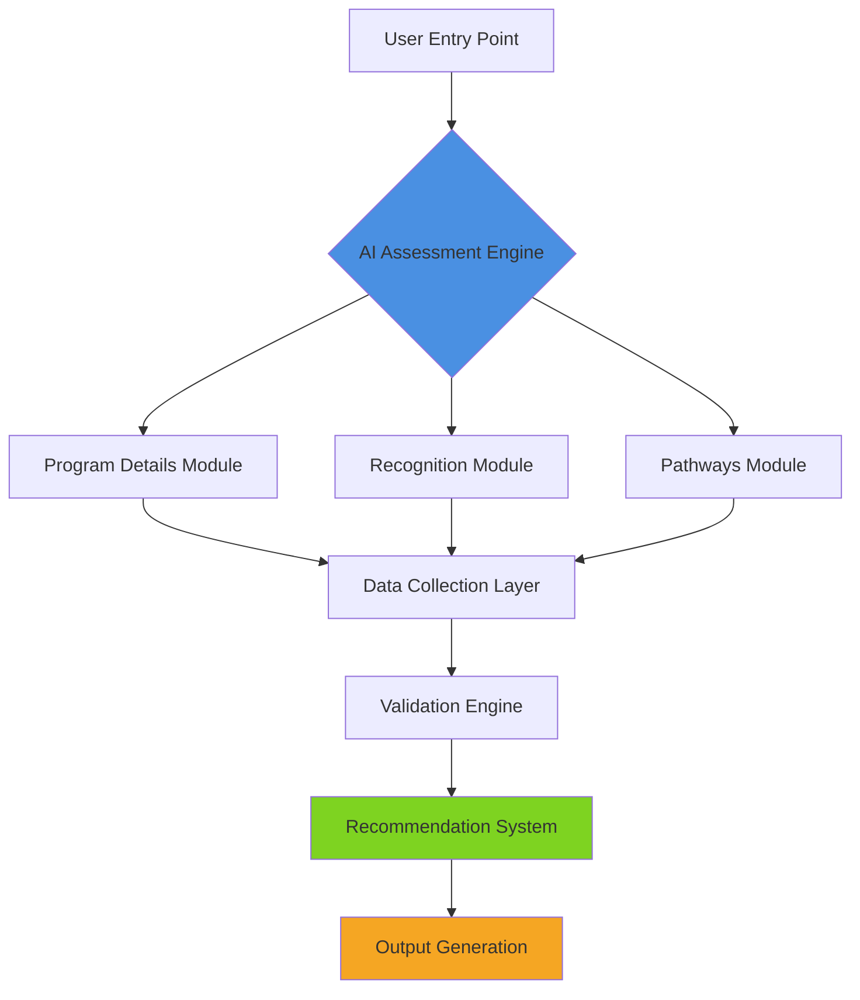
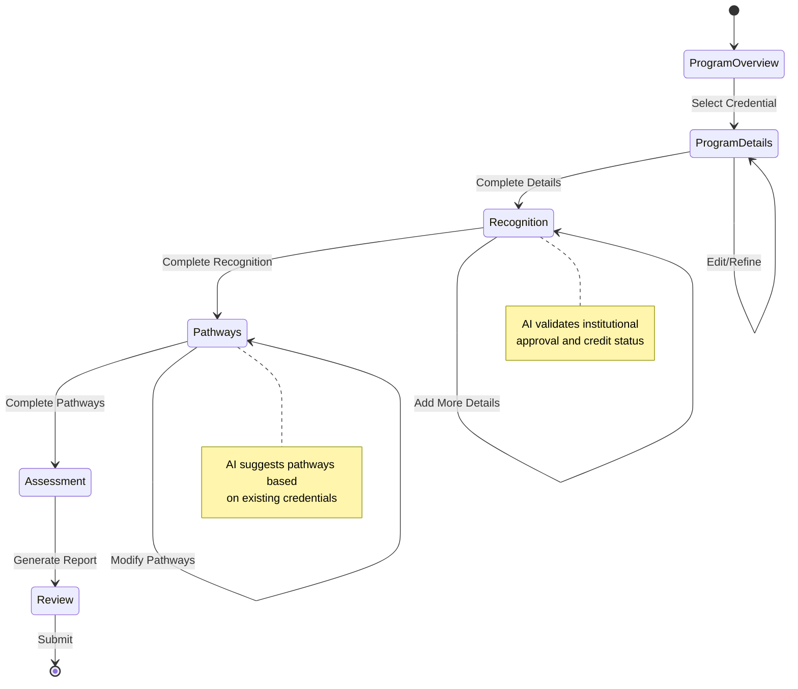
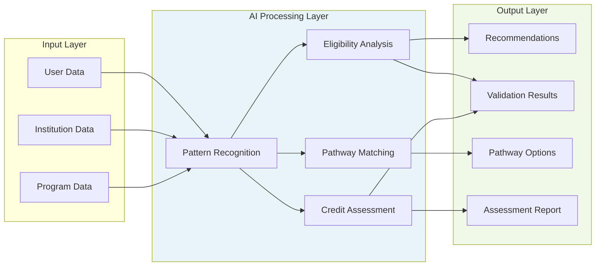
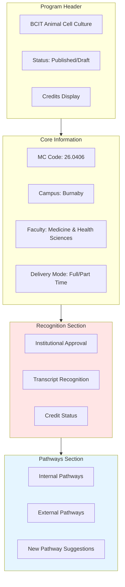
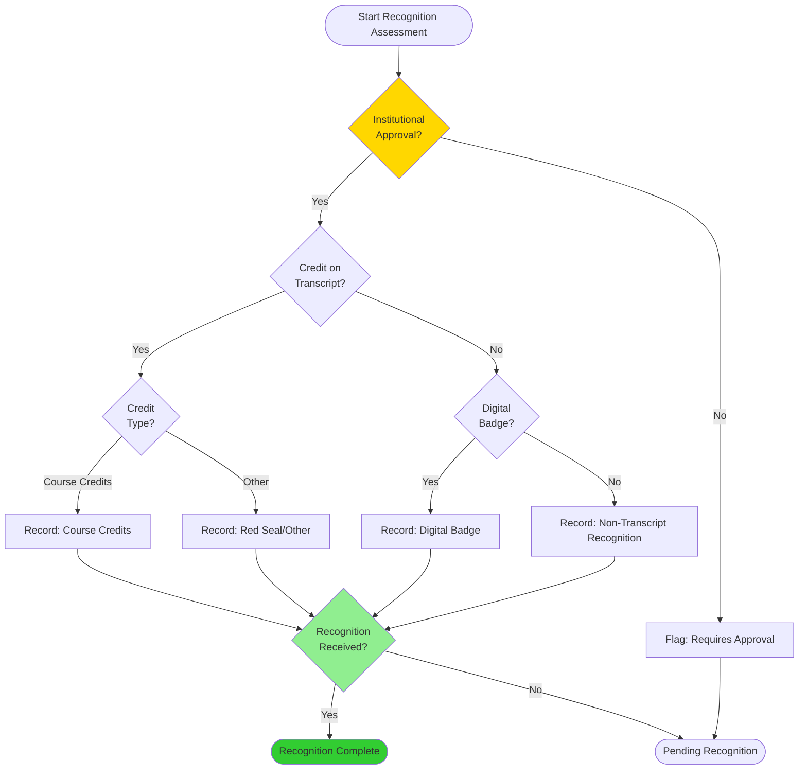
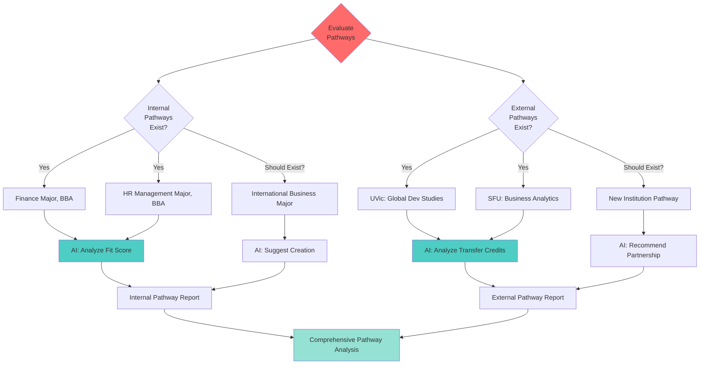
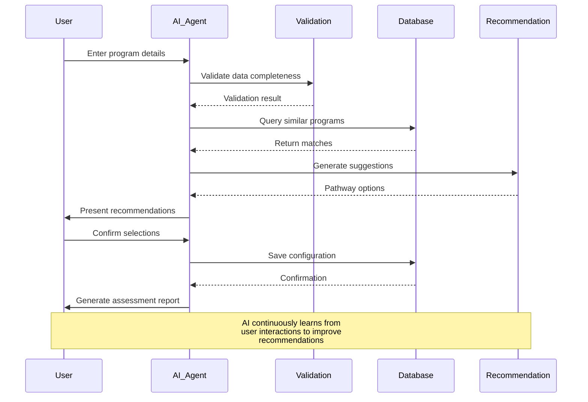
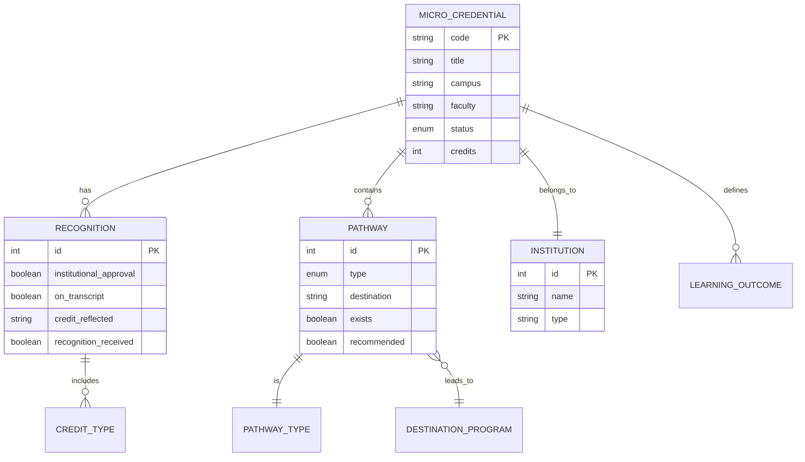
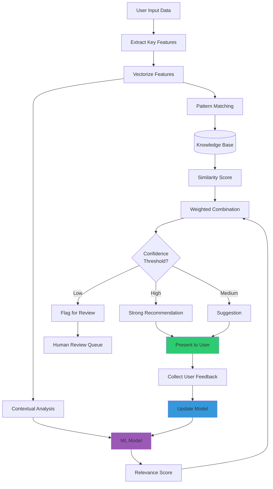

# AI-Native Micro-Credentials Platform - Mermaid Diagrams

This document contains all the Mermaid diagrams visualizing the system architecture, data flows, and decision logic for the BCCB micro-credentials platform.

## Table of Contents

1. [System Architecture Overview](#system-architecture-overview)
2. [Application State Machine](#application-state-machine)
3. [Data Flow Architecture](#data-flow-architecture)
4. [Micro-Credentials Form Structure](#micro-credentials-form-structure)
5. [Recognition Logic Flow](#recognition-logic-flow)
6. [Pathways Decision Tree](#pathways-decision-tree)
7. [AI Conversation Flow](#ai-conversation-flow)
8. [Entity Relationship Diagram](#entity-relationship-diagram)
9. [AI Recommendation Engine Logic](#ai-recommendation-engine-logic)

---

## System Architecture Overview

## Application State Machine

## Data Flow Architecture

## Micro-Credentials Form Structure

## Recognition Logic Flow

## Pathways Decision Tree

## AI Conversation Flow

## Entity Relationship Diagram

## AI Recommendation Engine Logic

---

## Usage

These diagrams can be rendered in:
- GitHub (natively)
- GitLab (natively)
- VS Code (with Mermaid extension)
- Documentation sites (with Mermaid plugin)
- Notion, Obsidian, and other tools supporting Mermaid

## Updating Diagrams

To update any diagram:
1. Edit the Mermaid code directly in this file
2. Test rendering using [Mermaid Live Editor](https://mermaid.live/)
3. Commit changes to version control

## Additional Resources

- [Mermaid Documentation](https://mermaid.js.org/)
- [Mermaid Syntax Reference](https://mermaid.js.org/intro/syntax-reference.html)
- [GitHub Mermaid Support](https://github.blog/2022-02-14-include-diagrams-markdown-files-mermaid/)
