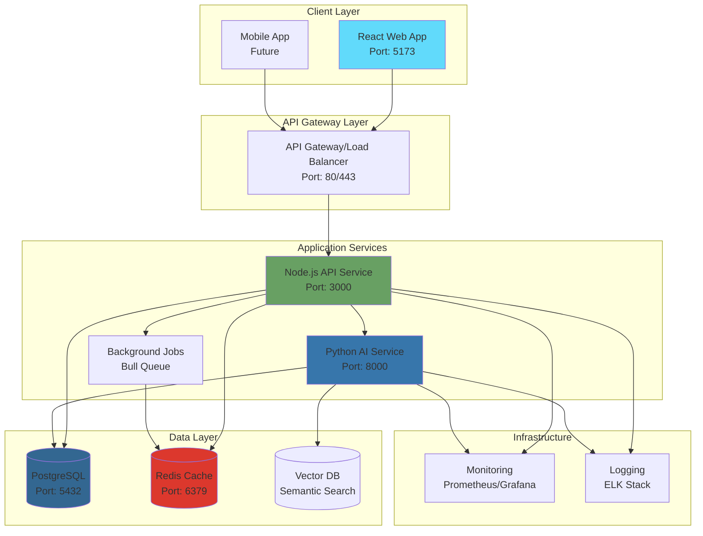
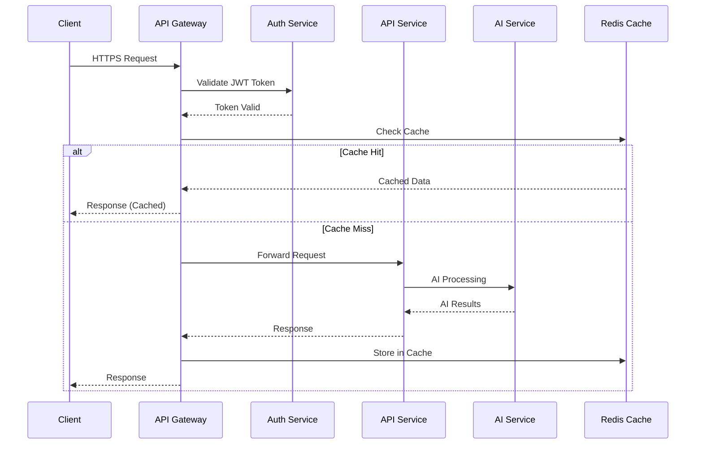
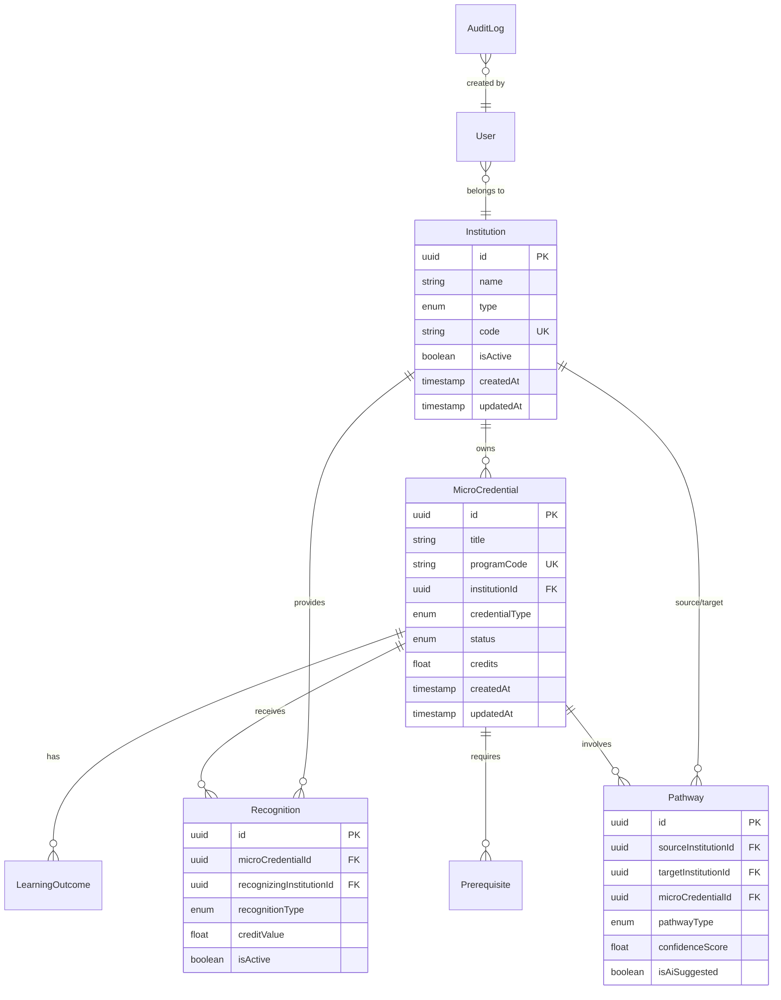
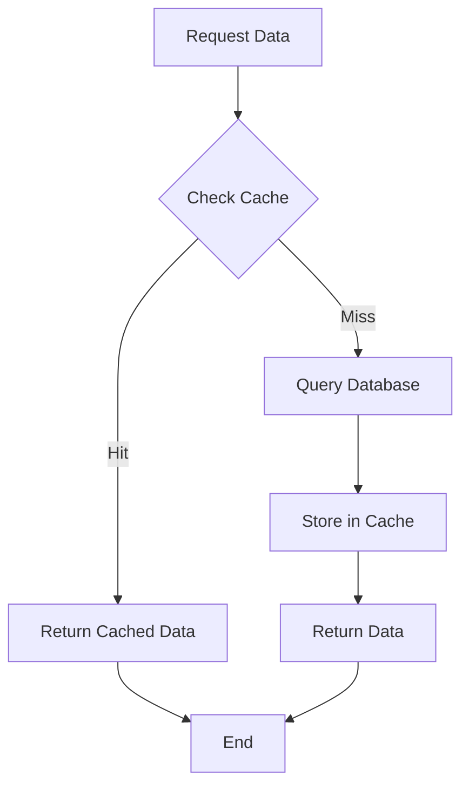
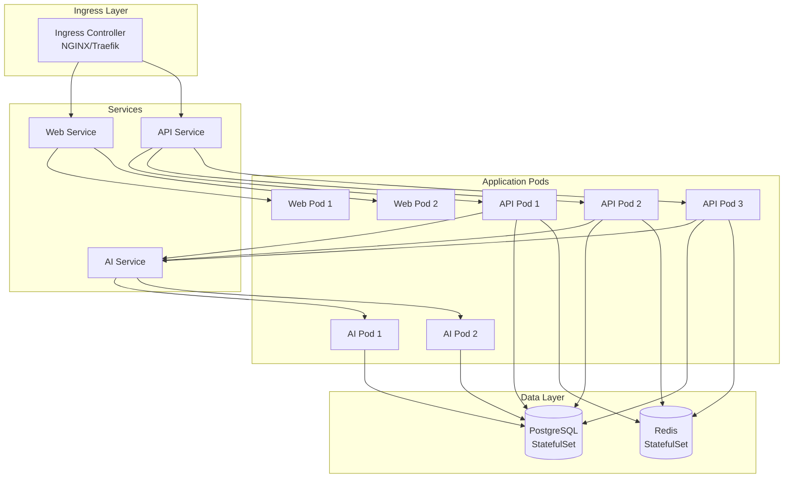

# System Architecture

## Overview

The AI-Native Micro-Credentials Platform (BCCB) is built as a modern, scalable monorepo using AI-first design principles. The system manages micro-credentials, pathways, and institutional recognition using intelligent, conversational interfaces instead of traditional form-based workflows.

## Architecture Principles

- **AI-Native Design**: Intelligence embedded throughout the system, not bolted on
- **Microservices Architecture**: Loosely coupled services with clear boundaries
- **Event-Driven**: Asynchronous communication for scalability
- **API-First**: All functionality exposed through well-defined APIs
- **Cloud-Native**: Containerized, stateless services designed for cloud deployment

## High-Level Architecture



## Monorepo Structure

The project uses a monorepo approach to manage multiple applications and shared packages in a single repository:

```
bccb/
├── apps/                      # Application services
│   ├── web/                  # React frontend (Vite + TypeScript)
│   └── api/                  # Node.js backend (Express + TypeScript)
├── packages/                  # Shared packages
│   ├── shared/               # Shared types, utilities, constants
│   └── ai-engine/            # Python AI/ML service (FastAPI)
├── database/                  # Database management
│   ├── schema/               # Prisma schema definitions
│   ├── migrations/           # Database migrations
│   └── seeds/                # Seed data for development/testing
├── infrastructure/            # Infrastructure as code
│   ├── docker/               # Docker configurations
│   ├── kubernetes/           # K8s manifests (future)
│   └── terraform/            # Cloud infrastructure (future)
├── tests/                     # Testing suites
│   ├── unit/                 # Unit tests
│   ├── integration/          # Integration tests
│   └── e2e/                  # End-to-end tests
└── docs/                      # Documentation
    ├── architecture/         # Architecture documentation
    ├── api/                  # API documentation
    └── deployment/           # Deployment guides
```

### Benefits of Monorepo

1. **Code Sharing**: Shared types and utilities across frontend, backend, and AI services
2. **Atomic Changes**: Make coordinated changes across multiple services
3. **Unified Versioning**: Single version number for the entire platform
4. **Developer Experience**: Clone once, develop everywhere
5. **Consistent Tooling**: Shared linting, testing, and build configurations

## Microservices Architecture

### 1. Web Application (Frontend)

**Technology Stack:**
- React 18 with TypeScript
- Vite for fast builds and HMR
- TailwindCSS for styling
- Redux Toolkit for state management
- React Query for data fetching
- Mermaid.js for diagram visualization

**Responsibilities:**
- User interface and interactions
- Data visualization (diagrams, charts)
- Client-side routing
- State management
- API communication

**Port:** 5173 (development), 80/443 (production)

### 2. API Service (Backend)

**Technology Stack:**
- Node.js 20+ runtime
- Express.js framework
- TypeScript for type safety
- Prisma ORM for database access
- JWT for authentication
- Bull for job queuing

**Responsibilities:**
- Business logic implementation
- RESTful API endpoints
- Authentication and authorization
- Data validation and transformation
- Database operations (CRUD)
- Integration with AI service
- Background job management

**Key Features:**
- Request validation middleware
- Error handling and logging
- Rate limiting
- CORS configuration
- Health checks and metrics

**Port:** 3000

**API Structure:**
```
apps/api/
├── src/
│   ├── controllers/          # Request handlers
│   ├── routes/               # Route definitions
│   ├── middleware/           # Custom middleware
│   ├── services/             # Business logic
│   ├── models/               # Data models (Prisma)
│   ├── utils/                # Helper functions
│   ├── config/               # Configuration
│   └── index.ts              # Application entry point
├── tests/                    # API tests
└── package.json
```

### 3. AI/ML Service

**Technology Stack:**
- Python 3.11+
- FastAPI framework
- scikit-learn for ML
- TensorFlow for deep learning
- Hugging Face Transformers for NLP
- spaCy for text processing
- FAISS for vector similarity search

**Responsibilities:**
- Pathway recommendations
- Credit assessment
- Semantic search
- Learning outcome classification
- NLP analysis
- Model training and inference
- Embedding generation

**Port:** 8000

See [AI/ML Architecture](./ai-architecture.md) for detailed information.

### 4. Background Jobs Service

**Technology Stack:**
- Bull (Redis-based queue)
- Node.js workers

**Responsibilities:**
- Async email notifications
- Report generation
- Batch data processing
- Model retraining triggers
- Data synchronization
- Scheduled tasks

## API Gateway Design

The API Gateway serves as the single entry point for all client requests:

### Responsibilities

1. **Routing**: Direct requests to appropriate backend services
2. **Load Balancing**: Distribute traffic across service instances
3. **Authentication**: Validate JWT tokens
4. **Rate Limiting**: Prevent abuse and ensure fair usage
5. **CORS**: Handle cross-origin requests
6. **SSL/TLS Termination**: Manage HTTPS certificates
7. **Request/Response Transformation**: Normalize data formats
8. **Caching**: Cache frequently accessed data
9. **Monitoring**: Collect metrics and logs

### Gateway Pattern



### Implementation

Currently implemented using:
- **Development**: Direct service access (no gateway)
- **Production**: NGINX reverse proxy (see `infrastructure/docker/nginx.conf`)

**Future Enhancement**: Consider API Gateway solutions like Kong, AWS API Gateway, or Azure API Management for advanced features.

## Database Design

### PostgreSQL Database

**Version:** PostgreSQL 15+

The system uses a single PostgreSQL database with Prisma ORM for type-safe database access.

### Schema Design Philosophy

1. **Normalization**: Follow 3NF to minimize data redundancy
2. **Relationships**: Use foreign keys to enforce referential integrity
3. **Indexing**: Strategic indexes on frequently queried columns
4. **Soft Deletes**: Maintain audit trail with `isActive` flags
5. **Timestamps**: Track creation and modification times
6. **UUIDs**: Use UUID primary keys for distributed systems

### Core Entities



### Database Indexes

Strategic indexes for query performance:

```sql
-- Institution indexes
CREATE INDEX idx_institutions_code ON institutions(code);
CREATE INDEX idx_institutions_type ON institutions(type);

-- MicroCredential indexes
CREATE INDEX idx_micro_credentials_institution_id ON micro_credentials(institution_id);
CREATE INDEX idx_micro_credentials_program_code ON micro_credentials(program_code);
CREATE INDEX idx_micro_credentials_status ON micro_credentials(status);
CREATE INDEX idx_micro_credentials_credential_type ON micro_credentials(credential_type);

-- Recognition indexes
CREATE INDEX idx_recognitions_micro_credential_id ON recognitions(micro_credential_id);
CREATE INDEX idx_recognitions_recognizing_institution_id ON recognitions(recognizing_institution_id);

-- Pathway indexes
CREATE INDEX idx_pathways_source_institution_id ON pathways(source_institution_id);
CREATE INDEX idx_pathways_target_institution_id ON pathways(target_institution_id);
CREATE INDEX idx_pathways_micro_credential_id ON pathways(micro_credential_id);

-- Audit log indexes
CREATE INDEX idx_audit_logs_entity ON audit_logs(entity_type, entity_id);
CREATE INDEX idx_audit_logs_user_id ON audit_logs(user_id);
CREATE INDEX idx_audit_logs_created_at ON audit_logs(created_at);
```

### Connection Pooling

Prisma handles connection pooling automatically:
- **Development**: 10 connections
- **Production**: Configurable based on load (default: 100)

### Backup Strategy

1. **Continuous Archiving**: WAL archiving enabled
2. **Daily Backups**: Full database backup at 2 AM UTC
3. **Retention**: 30 days for daily, 12 months for monthly
4. **Point-in-Time Recovery**: Enabled for disaster recovery

## Caching Strategy

### Redis Cache

**Version:** Redis 7+

Redis is used for multiple caching and performance optimization purposes:

### Use Cases

#### 1. API Response Caching

Cache frequently accessed, slowly changing data:
- Institution lists
- Published micro-credentials
- Public pathway information
- User profile data

**TTL Strategy:**
- Institution data: 1 hour
- Micro-credentials: 15 minutes
- Pathways: 30 minutes
- User profiles: 5 minutes

**Cache Keys Pattern:**
```
bccb:institutions:list:v1
bccb:credential:{id}:v1
bccb:pathways:institution:{id}:v1
bccb:user:{id}:profile:v1
```

#### 2. Session Storage

Store user sessions and JWT blacklist:
- Active sessions
- Invalidated tokens
- Rate limit counters

#### 3. Job Queue

Bull queue for background processing:
- Email notifications
- Report generation
- Data exports
- Model retraining triggers

#### 4. Real-time Data

Temporary data for real-time features:
- Active user counts
- Recent activity feeds
- Notification counters

### Cache Invalidation

**Strategies:**
1. **Time-based**: Set appropriate TTL for each data type
2. **Event-based**: Invalidate on data modifications (create/update/delete)
3. **Pattern-based**: Bulk invalidation using key patterns

**Implementation Example:**
```typescript
// Cache service
class CacheService {
  async get(key: string): Promise<any> {
    return await redis.get(key);
  }
  
  async set(key: string, value: any, ttl: number): Promise<void> {
    await redis.setex(key, ttl, JSON.stringify(value));
  }
  
  async invalidate(pattern: string): Promise<void> {
    const keys = await redis.keys(pattern);
    if (keys.length > 0) {
      await redis.del(...keys);
    }
  }
  
  async invalidateCredential(id: string): Promise<void> {
    await this.invalidate(`bccb:credential:${id}:*`);
    await this.invalidate(`bccb:pathways:credential:${id}:*`);
  }
}
```

### Cache-Aside Pattern



## Deployment Architecture

### Container-Based Deployment

All services are containerized using Docker for consistency across environments.

### Development Environment

**Docker Compose Setup:**

```yaml
services:
  postgres:    # Database
  redis:       # Cache & Queue
  api:         # Backend service
  web:         # Frontend service
  ai-service:  # AI/ML service
```

All services run on a single host with Docker Compose.

### Production Environment (Future)

**Kubernetes Cluster:**



**Key Features:**
- **Auto-scaling**: Horizontal pod autoscaling based on CPU/memory
- **Load Balancing**: Service-level load balancing
- **Rolling Updates**: Zero-downtime deployments
- **Health Checks**: Liveness and readiness probes
- **Resource Limits**: CPU and memory constraints
- **Secrets Management**: Kubernetes secrets for sensitive data

### Infrastructure Components

#### 1. Load Balancer
- **Development**: Docker Compose port mapping
- **Production**: Cloud load balancer (AWS ALB, GCP Load Balancer)

#### 2. Container Registry
- **Development**: Local Docker images
- **Production**: Private container registry (Docker Hub, ECR, GCR)

#### 3. Database
- **Development**: Docker container
- **Production**: Managed database service (AWS RDS, Google Cloud SQL)

#### 4. Cache
- **Development**: Docker container
- **Production**: Managed Redis (AWS ElastiCache, Google Memorystore)

#### 5. Storage
- **ML Models**: Object storage (S3, GCS)
- **File Uploads**: Object storage with CDN
- **Logs**: Centralized logging service

## Communication Patterns

### Synchronous Communication

**REST APIs** for client-server and service-to-service communication:
- Web app ↔ API service
- API service ↔ AI service

**Benefits:**
- Simple request-response pattern
- Easy to debug and monitor
- Well-understood by developers

### Asynchronous Communication

**Job Queue** for background processing:
- Email notifications
- Report generation
- Batch operations

**Benefits:**
- Non-blocking operations
- Fault tolerance
- Load smoothing

### Event-Driven Architecture (Future)

**Message Queue** for event propagation:
- Credential published event
- Recognition updated event
- Pathway approved event

**Benefits:**
- Loose coupling between services
- Scalability
- Event sourcing for audit trail

## Security Architecture

### Authentication & Authorization

1. **JWT-based Authentication**
   - Access tokens (short-lived, 15 minutes)
   - Refresh tokens (long-lived, 7 days)
   - Token stored in httpOnly cookies

2. **Role-Based Access Control (RBAC)**
   - Admin: Full system access
   - Institution Admin: Institution-level management
   - Program Coordinator: Program-level operations
   - User: Read-only access

3. **API Security**
   - HTTPS only in production
   - CORS configuration
   - Rate limiting per IP/user
   - Request validation

### Data Security

1. **Encryption at Rest**
   - Database encryption
   - Backup encryption

2. **Encryption in Transit**
   - TLS 1.3 for all communications
   - Certificate management

3. **Secrets Management**
   - Environment variables for configuration
   - Kubernetes secrets in production
   - No secrets in code or version control

4. **Data Privacy**
   - Minimal data collection
   - GDPR compliance considerations
   - Audit logging for sensitive operations

## Monitoring & Observability

### Logging

**Structured JSON Logs:**
```json
{
  "timestamp": "2024-01-02T19:00:00Z",
  "level": "info",
  "service": "api",
  "message": "Request processed",
  "requestId": "uuid",
  "userId": "uuid",
  "duration": 45,
  "endpoint": "/api/credentials"
}
```

**Log Levels:**
- ERROR: Critical issues requiring immediate attention
- WARN: Warning conditions that may need investigation
- INFO: General informational messages
- DEBUG: Detailed debugging information

**Log Aggregation:**
- Development: Console output
- Production: ELK stack (Elasticsearch, Logstash, Kibana) or cloud service

### Metrics

**Application Metrics:**
- Request count and latency
- Error rates
- Database query performance
- Cache hit/miss rates
- ML model inference time

**Infrastructure Metrics:**
- CPU and memory usage
- Disk I/O
- Network traffic
- Container health

**Business Metrics:**
- Active users
- Credentials created
- Pathways recommended
- Recognition approvals

**Tools:**
- Prometheus for metrics collection
- Grafana for visualization
- Custom dashboards for key metrics

### Health Checks

Each service exposes health check endpoints:

```
GET /health
GET /health/ready
GET /health/live
```

**Health Check Types:**
1. **Liveness**: Is the service running?
2. **Readiness**: Is the service ready to accept traffic?
3. **Startup**: Has the service finished initialization?

### Alerting

**Alert Conditions:**
- Service down or unhealthy
- Error rate exceeds threshold (5% in 5 minutes)
- Response time exceeds threshold (>2s p95)
- Database connection issues
- Cache unavailability
- Disk space low (<10%)
- Memory usage high (>90%)

**Alert Channels:**
- Email notifications
- Slack/Teams integration
- PagerDuty for critical alerts

## Scalability Considerations

### Horizontal Scaling

Services designed to scale horizontally:
- **API Service**: Stateless, can run multiple instances
- **AI Service**: Stateless, can run multiple instances
- **Web Service**: Static files served by CDN

### Vertical Scaling

For resource-intensive operations:
- Database: Increase CPU/memory for complex queries
- AI Service: GPU instances for model inference

### Database Scaling

1. **Read Replicas**: For read-heavy workloads
2. **Connection Pooling**: Efficient connection management
3. **Query Optimization**: Proper indexing and query tuning
4. **Partitioning**: For large tables (future)

### Caching Strategy

Multi-level caching:
1. Browser cache (static assets)
2. CDN cache (static content)
3. Application cache (Redis)
4. Database query cache

## Performance Optimization

### API Performance

1. **Response Compression**: Gzip/Brotli compression
2. **Pagination**: Limit result set sizes
3. **Field Selection**: Return only requested fields
4. **Lazy Loading**: Load related data on demand
5. **Batch Endpoints**: Reduce round trips

### Database Performance

1. **Indexing**: Strategic indexes on query columns
2. **Query Optimization**: Use EXPLAIN to analyze queries
3. **Connection Pooling**: Reuse database connections
4. **Prepared Statements**: Parameterized queries
5. **Batch Operations**: Bulk inserts/updates

### Frontend Performance

1. **Code Splitting**: Load code on demand
2. **Lazy Loading**: Load components when needed
3. **Asset Optimization**: Minification and compression
4. **CDN**: Serve static assets from CDN
5. **Service Worker**: Offline capabilities

## Disaster Recovery

### Backup Strategy

1. **Database Backups**
   - Automated daily backups
   - Point-in-time recovery capability
   - 30-day retention policy

2. **Configuration Backups**
   - Infrastructure as code in version control
   - Environment variable documentation

3. **ML Model Backups**
   - Versioned models in object storage
   - Training data snapshots

### Recovery Procedures

**RTO (Recovery Time Objective)**: 4 hours
**RPO (Recovery Point Objective)**: 24 hours

**Recovery Steps:**
1. Restore database from latest backup
2. Deploy services from container registry
3. Apply database migrations if needed
4. Restore Redis cache from snapshots
5. Validate system functionality
6. Update DNS if needed

## Future Enhancements

### Planned Improvements

1. **Kubernetes Deployment**
   - Container orchestration
   - Auto-scaling
   - Self-healing

2. **Message Queue**
   - RabbitMQ or Kafka
   - Event-driven architecture
   - Better service decoupling

3. **API Gateway**
   - Dedicated gateway (Kong, AWS API Gateway)
   - Advanced routing
   - Better rate limiting

4. **Service Mesh**
   - Istio or Linkerd
   - Service-to-service security
   - Advanced traffic management

5. **GraphQL API**
   - Alternative to REST
   - Efficient data fetching
   - Better developer experience

6. **Real-time Features**
   - WebSocket support
   - Real-time notifications
   - Collaborative editing

## References

- [AI/ML Architecture](./ai-architecture.md)
- [Data Models](./data-models.md)
- [API Reference](../api/endpoints.md)
- [Deployment Guide](../deployment/infrastructure.md)
- [Mermaid Diagrams](./mermaid-diagrams.md)

---

**Last Updated**: January 2024  
**Version**: 1.0  
**Maintainers**: BCCB Platform Team
